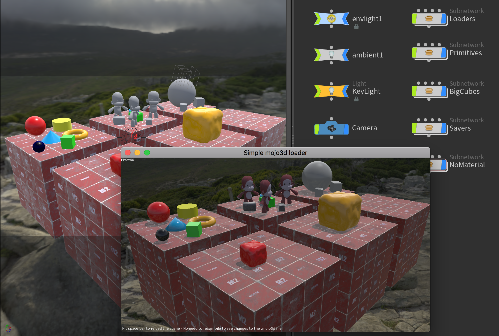

# Houdini-To-Mojo3D-Exporter
A Python exporter that converts a Simple Houdini Scene to a .mojo3d file.



## Warning!

Very experimental! Many features missing, and generally feels very fragile (not a lot of safety checks). Expect the compiled Monkey2 code loading the generated files to crash a lot. Make sure you have Debug build on, and let me know which problems you run into so that I can improve it.

One common problem is that relative paths (using $JOB variables, for instance) don't seem to work. Try to use absolute paths whenever possible. Those paths can be converted to "asset::" style paths in the generated mojo3d scene using the "Convert paths to asset paths" option.

## Installation
The exporter consists of a single Python script. You can launch it inside Houdini in any way you prefer, as long as you call the export() function from the script.

The recommended way is through a shelf tool. When you create a new shelf tool, simply go to its "Script" tab and add these lines:
```
execfile("/Path/mojo3d_export.py")
export()
```
Replace "Path" with the path to the script file in your filesystem.

## Houdini nodes supported

Basic attributes:
- Name.
- Material (multiple materials per object not supported yet).
- Local transform matrix.
- Object Node display flag, object is not exported if off.
- SOP node bypass flag, object is not exported if on.

Subnetworks:
- Are exported as a Pivot entity above the children objects in the hierarchy.
- It is recommended that subnetworks don't have a transform parent of their own, and only live at "/obj"

Primitive geometry:
 - Box.
 - Sphere (Set primitive type to polygon mesh for accurate export).
 - Tube (exports as Cylinder, but if top radius is zero exports as cone).
 - Torus.
 
 Lights:
 - Point, Spot and Directional lights only
 - Ambient light is supported, but not accurate (Houdini's Ambient light looks terrible!).
 - Environment lights are exported as both SkyTexture and Envtexture.
 - Attenuation export is not accurate yet.
 
 Camera:
 - Near, far and FOV supported
 
 Materials:
 - Actual SOP material nodes aren't supported yet. Instead, assign materials at the object level.
 - Only Principled shader materials supported.
 - Color, Roughness, Metallic, Emissive and Normal channels are supported.
 
 Models:
 - File nodes are supported in two ways:
    - When writing, the written file is loaded in mojo3d without hierarchy ("Model.Load").
    - If loading, any "sibling" nodes with file nodes are ignored, and the model is loaded with hierarchy ("Model.LoadBoned"). This is due to the way Houdini loads .fbx files, creating a file node for each object in the fbx scene, which would cause mojo3d to load the same model multiple times.
 - Materials can be overriden if the "Collapse hierarchy on load" option is On.
 
 Instancing:
 - Redundant loads (textures or models) are consolidated into a single load in the mojo3d side.
 - Object Merge nodes are supported, and will create model instances. Must point to the "base" geometry node, not any child node inside it.
  
